# Deploying a Java Spring Boot application using Jenkins and Setting up a Pipeline

## Prerequisites

- Java 11 or higher
- Maven
- Docker
- Jenkins
- Git

## Step 1: Setting up Jenkins

1. Install Jenkins on your server or local machine.
2. Open Jenkins in your browser.

Go to downloads folder and run the following command:

```bash
java -jar jenkins.war
```

## Step 2: Creating a new Jenkins job

1. Click on "New Item" button.
2. Enter a name for your job.
3. Select "Pipeline" and click "OK".
    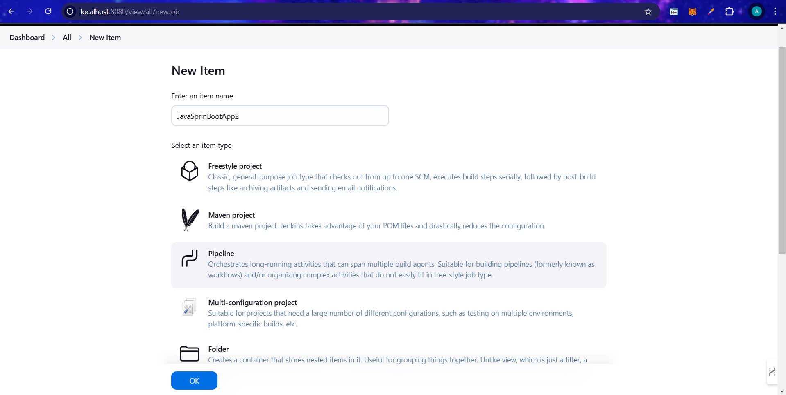
4. Setup the configuration
    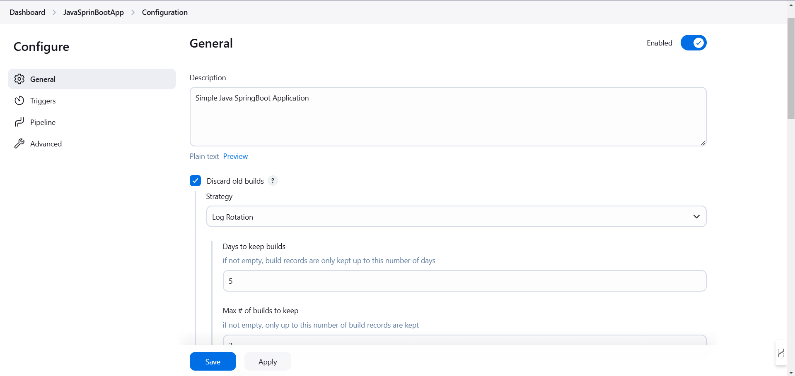
    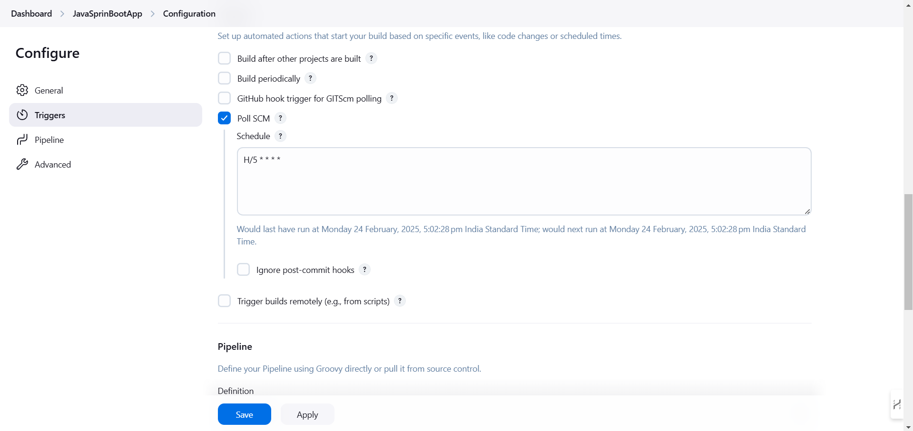

5. Add the pipeline script using groovy script.
    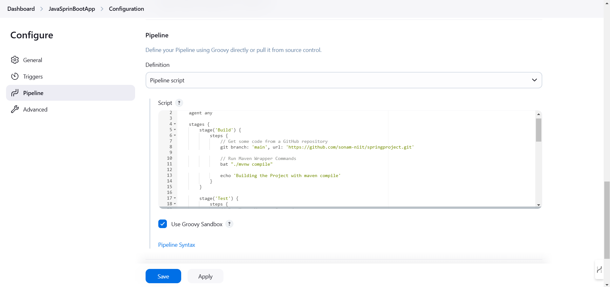

    ```groovy
    pipeline {
        agent any

        stages {
            stage('Build') {
                steps {
                    // Get some code from a GitHub repository
                    git branch: 'main', url: 'https://github.com/sonam-niit/springproject.git'

                    // Run Maven Wrapper Commands
                    bat "./mvnw compile"

                    echo 'Building the Project with maven compile'
                }
            }

            stage('Test') {
                steps {
                    // Run Maven Wrapper Commands
                    bat "./mvnw test"

                    echo 'Testing the Project with maven test'
                }
            }

            stage('Package') {
                steps {
                    // Run Maven Wrapper Commands
                    bat "./mvnw package"

                    echo 'Packaging the Project with maven package'
                }
            }

            stage('Containerize') {
                steps {
                    // Build Docker image
                    bat "docker build -t myapp ."

                    echo 'Containerizing the App with Docker'
                }
            }

            stage('Deploy') {
                steps {
                    script {
                        // Check if the container is running
                        def containerRunning = bat(script: 'docker ps -q -f name=sbapp', returnStdout: true).trim()
                        if (containerRunning.isInteger()) {
                            // Stop and remove the running container
                            bat "docker stop sbapp"
                            bat "docker rm sbapp"
                        }
                    }

                    // Run Docker container
                    bat "docker run -d --name sbapp -p 9092:8082 myapp"

                    echo 'Deploying the App with Docker'
                }
            }
        }
    }
    ```

    **Note:**
    1. SpringBoot application is running on port 8082 and the container is running on port 9092.
    2. SpringBoot application created by the instructor is used in this pipeline - [https://github.com/sonam-niit/springproject.git](https://github.com/sonam-niit/springproject.git).

6. Click "Save" button.

## Step 3: Running the job

1. Click on the "Build Now" button to run your job.
2. Monitor the build progress in the Jenkins stages.
    

3. The sbapp container will be deployed and the application will be running.
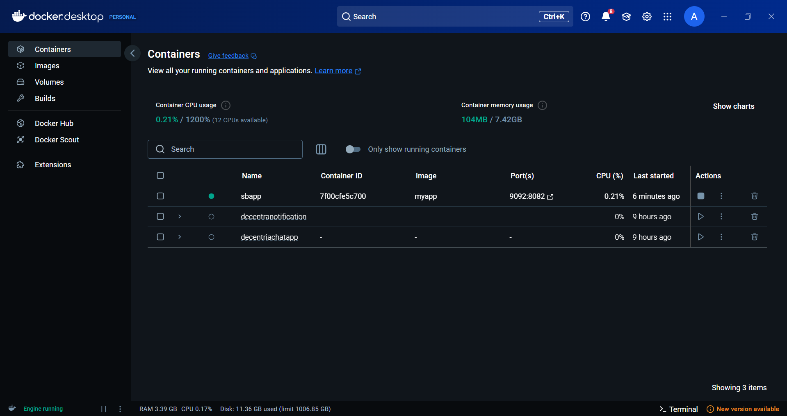

## Step 4: Deploying the application

1. Open the application in your browser using `http://localhost:9092/api/product/5678`.
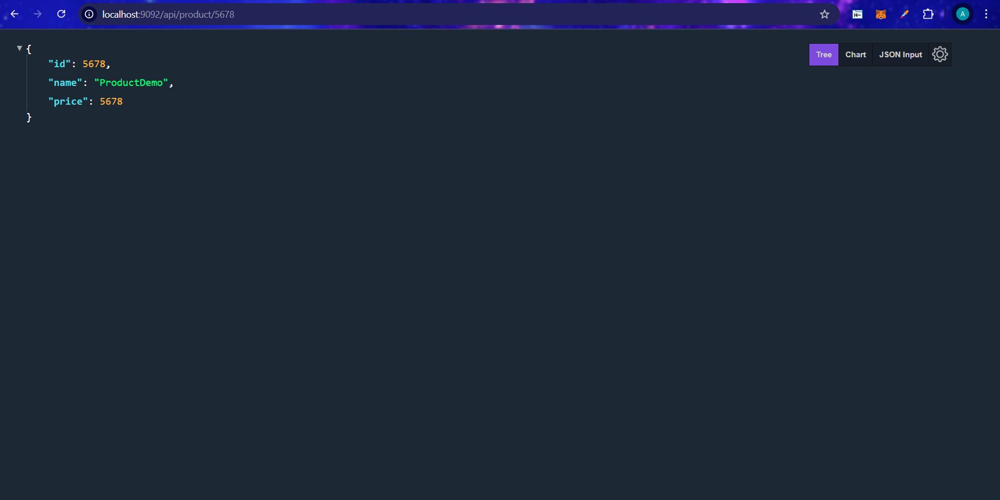

## Step 5: Updating the application

1. Once the application is deployed, you can update it by pushing the changes to the repository.
2. Jenkins will automatically detect the changes and build the application.
3. Once the build is successful, the application will be deployed again.
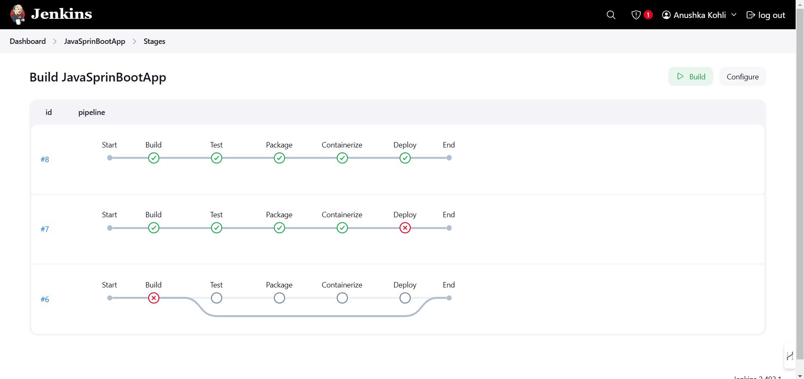

## Note

1. Add the Docker and Maven to the Jenkins server by going to Dashboard -> Manage Jenkins -> Manage Plugins -> Available -> Docker and Maven.
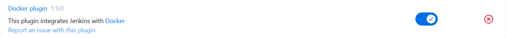
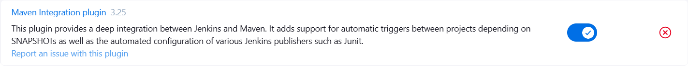

2. Add the JDK and Maven to the Jenkins server by going to Dashboard -> Manage Jenkins -> Tools -> Add JDK and Maven.
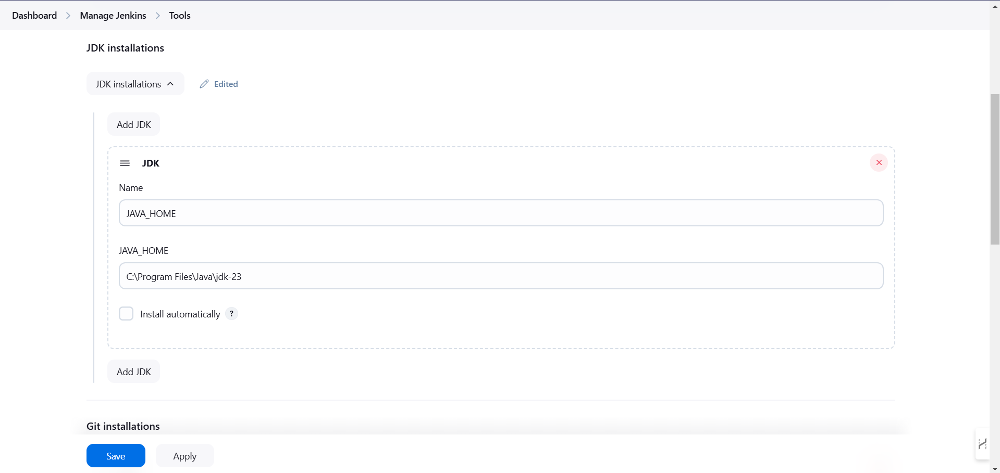
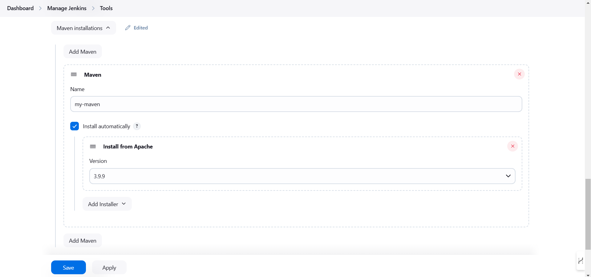
